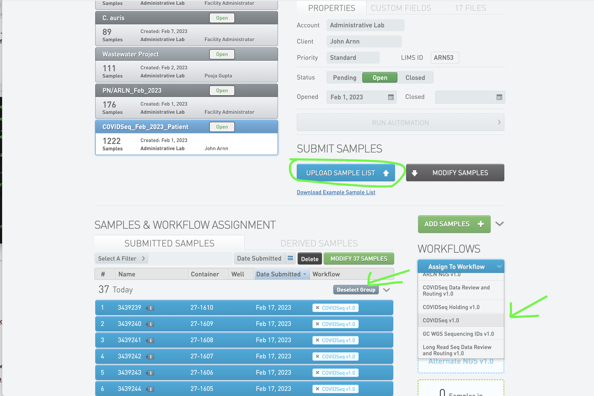
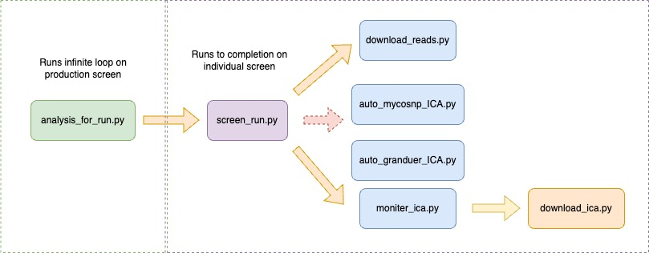

# General_LW_scripts
The scripts that UPHL uses to download things from basespace and run respective workflows

# USAGE


## MiSeq_runs_basespace.sh

MiSeq_runs_basespace.sh checks basespace every 20 minutes for a new MiSeq sequencing run. This is the script that is run in a screen on the Production account.

Script downloads run data to IDGenomics_NAS and also uploads to ICA. icav2 needs to be installed and configured to work. 

Currently only runs Grandeur.

```
MiSeq_runs_basespace.sh
```

## daily_SARS-CoV-2_metadata.sh

daily_SARS-CoV-2_metadata.sh checks the date every 4 hours. If it is a new day, this script runs the Dripping Rock nextflow workflow to get the daily SARS-CoV-2 metadata file. On Sundays, it also takes the latest 20 runs and 10 random runs and creates a phylogenetic tree. This is a script that is run in a screen on the Production account.

## accession_for_clarity.py

accession_for_clarity.py is a script that creates an accessioning file for Clarity that has the new samples found in the Labware lims system that will be ready for the lab to process. The output of the script is a csv file, that must be saved as an excel file before Clarity will accept it. To be able to run the script you must have these two servers mounted on your computer; smb://172.16.109.9 and smb://168.180.220.43 or //LABWARE/ and ///DDCP/UPHL/. You also need to log into Clarity and download all samplesheets from projects with a name that starts with COVIDSeq, including the project COVIDSeq_From_TEST_DO_NOT_PUT_IN_WORKFLOW. Do this by going to the 'Projects and Samples' tab, choosing the correct project, and clicking the modify samples button. This will insure we do not place duplicates in Clarity which causes many issues.


Files will be downloaded from clicking the modify samples button. 

Now to run the script ```python accession_for_clarity.py "path/to/files/fromclarity" "path/to/files/fromclarity.etc"``` ...

The csv file that the script creates will be saved to the directory that you are running the script from. You must open the file in excel and save it to the excel file. Now back in Clarity click the button 'Upload Sample List' and choose the excel file.



Now click select group for the samples you just uploaded. Then choose 'Covidseq v1.0' after clicking 'Assign to Workflow'. And finally you are done!

# Automation Scripts for ICA 
Currently written for Pulsenet/ARLN samples that typically run on Grandeur and Mycosnp.

The scripts are structured to run sequentially; and can be triggered manually or by the previous scirpt.


## analysis_for_run.py

```
USAGE: Run this on a screen. It is an infinate loop and looks for new runs.

EXAMPLE: python3 analysis_for_run.py
```

## screen_run.py

## download_reads.py

## auto_mycosnp_ICA.py

This script will create a samplesheet, upload the samplesheet to ICA, collect needed ICA ids to start a pipeline analysis,
build the icav2 command to start, and then start the analysis. If analysis fails to start; use the icav2 arg that is created,
then use icav2 manually to troubleshoot issue. Most likely: icav2 config incorrectly; IDS incorrect; IDS not linked to project; syntax issue with command. An optional 2nd arguement can be included that will add to the ICA User Reference for the analysis. It is recommended if an ICA analysis has already been tried. Having the same User Reference can give ICA problems.

```
EXAMPLE:
python auto_mycosnp_ICA.py UT-VH0770-220915
```

## auto_granduer_ICA.py

This script will collect needed ICA ids to start a pipeline analysis; build the icav2 command to start, and then start the analysis.
If analysis fails to start use the icav2 arg that is created, then use icav2 manually to troubleshoot issue.
Most likely: icav2 config incorrectly; IDS incorrect; IDS not linked to project; syntax issue with command. An optional 2nd arguement can be included that will add to the ICA User Reference for the analysis. It is recommended if an ICA analysis has already been tried. Having the same User Reference can give ICA problems.

```
EXAMPLE:
python auto_mycosnp_ICA.py UT-VH0770-220915
```

## download_ica.py
